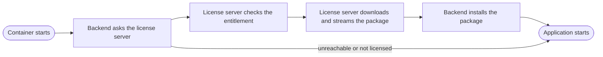

SentryMail is open core: the core is open source and fully usable on its own. Beyond it there are
**exactly two paid add-ons**.

| Add-on | Scope |
|---|---|
| **Business** | every feature marked *Business* |
| **Enterprise** | every *Enterprise* feature — **plus all Business features** |

Enterprise is not a second product alongside Business, it is the tier above it. Licensing
Enterprise means you do not need Business separately. Which feature belongs to which tier is
listed under [Features](/en/reference/funktionen/); the **Add-ons** area of the dashboard shows
the same mapping.

## 1. Buying

After purchase you receive the **license key by email** at the address given with the order. The
key is a long string of three parts separated by dots and belongs to exactly one organisation.

What we need from you: the email address for delivery and the number of users to license. We do
**not** need an installation or server identifier — the key is not bound to a particular machine,
so you can move or rebuild your installation freely.

:::caution[Keep the key safe]
The key is the proof of your purchase. Keep the email or store the key in your password manager.
We do reissue lost keys, but it costs you time.
:::

## 2. Activating

Two values in your installation's `.env`:

```ini
LICENSE_SERVER_URL=https://license.sentrymail.de
LICENSE_KEY=eyJhbGciOiJSUzI1NiIsInR5cCI6IkpXVCJ9...
```

The key goes on **one** line, without quotes, without leading or trailing spaces and without a
line break. Copy it from the email by double-clicking the string rather than dragging a
selection — that way no space comes along.

Alternatively the key can be entered in the dashboard under **Settings → License**. A value in
the `.env` takes precedence.

Then restart the stack:

```bash
docker compose up -d
```

:::danger[`restart` is not enough]
`docker compose restart` only restarts the process inside the existing container — the changed
`.env` is **not** re-read. Use `docker compose up -d`; it detects the changed configuration and
recreates the container.
:::

## 3. What happens at startup

The add-ons are **not** part of the backend image. They are fetched at startup — through the
license server, not from a package source on the internet:



Three properties you can rely on:

**A failure never blocks your installation.** If the license server is unreachable or the license
has expired, SentryMail still starts — with the open-core scope. An outage on our side does not
stop your operation.

**Only changes are downloaded.** If the package is already installed in the matching version,
startup transfers nothing.

**You need no credentials for a package source.** The license server fetches the package itself
and streams it through. Your installation only ever knows your license key.

## 4. Verifying activation

In the dashboard: the **Add-ons** area shows *licensed* and *installed* per tier. Both must be
green — *licensed but not installed* means the fetch at startup did not succeed.

In the log:

```bash
docker compose logs backend | grep -i addons
```

Expected output on successful activation:

```
addons: business: humanshield_addon_business-0.18.1-py3-none-any.whl installiert
addons: enterprise: humanshield_addon_enterprise-0.17.1-py3-none-any.whl installiert
```

With a Business-only license just the first line appears; for Enterprise both appear, because
Enterprise includes the Business features.

:::note[Why it says "humanshield"]
The Python packages still carry the product's former name. This is deliberate: renaming the
package namespace would break existing installations on update without any benefit. Product,
repositories and license server are called **SentryMail**; only the internal package names stayed
as they were.
:::

## 5. How activation works over time

Your installation fetches a short-lived clearance from the license server **once a day**, called a
lease. It is valid for **seven days**.

That is your outage tolerance: if the license server is temporarily unreachable, your installation
keeps working unchanged until the last fetched lease expires. Only then does it fall back to the
open-core scope — it does not shut down and it loses no data.

:::note[No offline operation]
An installation permanently disconnected from the internet cannot use the paid add-ons.
Verification happens online only; there is deliberately no offline-valid licensing scheme. The
core is unaffected and works without any connection.
:::

## 6. What data leaves your server

You run SentryMail yourself so that your data stays with you. So here is the complete list of what
the daily license check transmits:

| Field | Content |
|---|---|
| `license_key` | your license key |
| `instance_id` | a random identifier generated at installation |
| `product`, `product_version` | product name and version |
| `active_users` | the **number** of active user accounts, as a figure |

That is all. **No** names, **no** email addresses, **no** campaigns, **no** results, **no**
content. `active_users` is a number with no link to individuals; it serves to reconcile against
the licensed user count.

## 7. When a license ends

If your subscription lapses or is cancelled, entitlement ends with the last valid lease. What
applies then:

- **Your data is fully retained.** Nothing is deleted.
- **Evidence already produced stays readable** — completions, certificates, reports. That is
  deliberate: you must be able to present your training records even after switching away.
- **Open assignments are frozen, not discarded.**
- New actions in the paid features are refused and the corresponding pages are locked.

If the license is renewed later, the features return with the next lease — no reinstallation
required.

## 8. When something does not work

**"License server unreachable" with `Name or service not known`**
A typo in `LICENSE_SERVER_URL` or a DNS problem. The value is exactly
`https://license.sentrymail.de`, with no trailing slash. Check with:

```bash
curl -s -o /dev/null -w '%{http_code}\n' https://license.sentrymail.de/health
```

Expected: `200`.

**"Invalid license key" although the key is correct**
Almost always a transfer error: a space before the key, quotes around it, or a line break in the
middle. Check the entry without displaying the key:

```bash
grep -c '^LICENSE_KEY=[A-Za-z0-9_.-]\+$' .env
```

`1` means clean, `0` means something is attached to it.

**The change to `.env` has no effect**
`docker compose restart` does not re-read the `.env`. Use `docker compose up -d`.

**"Licensed but not installed" in the dashboard**
The license is valid but the package fetch at startup failed — usually because there was no
connection at that moment. A `docker compose up -d` repeats the attempt. If it persists, the log
helps:

```bash
docker compose logs backend | grep -i addons
```

If that does not get you further, send us those log lines — they contain neither your key nor any
personal data.
