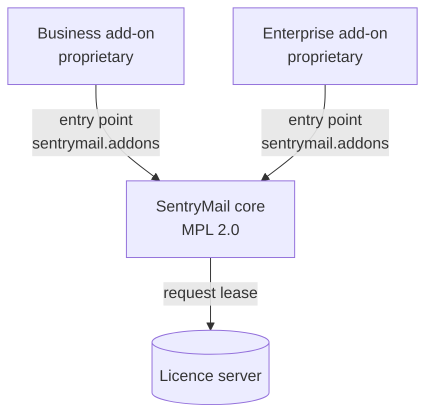
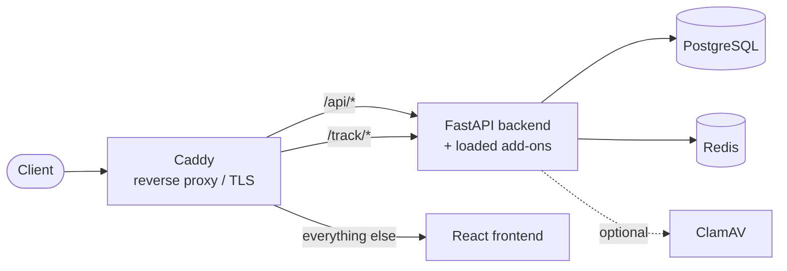

## Stack

- **Backend:** FastAPI (Python), SQLAlchemy, Alembic migrations
- **Frontend:** React + Vite + TypeScript, Tailwind CSS (design token system, light/dark)
- **Database:** PostgreSQL
- **Cache/queue:** Redis
- **Reverse proxy / TLS:** Caddy
- **Operations:** Docker Compose (rootless, hardened)
- **Optional:** ClamAV as a compose profile (`--profile scanning`), off by default

## Open core and add-ons

The core is licensed under MPL 2.0. The commercial features live in **separate packages** installed only for licensed customers — not as disabled code inside the core.

An add-on exposes an entry point in the group `sentrymail.addons` pointing at a module with `FEATURE_ID` and `register(app)`. `register` mounts the add-on's routers — each behind `require_feature(FEATURE_ID)`.

**The loader only decides whether a package is present; the feature gate lives in the add-on itself.** With no add-on installed nothing happens — pure open-core operation is the normal case, not a special one.

Every add-on brings **its own migrations with its own version table** (`alembic_version_business`, `alembic_version_enterprise`). The core knows nothing of the add-ons' tables; an add-on can be added later without migrating the core.

## Licensing

The instance fetches a short-lived, **EdDSA-signed lease** from the licence server carrying the unlocked feature IDs and the seat count. It is verified locally against the public key — the licence server does not need to be reachable during normal operation.

If it is not, the existing lease stays valid until it expires (`grace`); only afterwards do the add-on routes fall back to 403. A network problem must not stop a running campaign.

## Routing (Caddy)

- `/api/*` → backend (prefix stripped) — including the add-on routers
- `/track/*` → backend (public tracking endpoints: pixel, click, landing, submit)
- everything else → frontend

## Key concepts

- **Singleton configs** in the database: LDAP, OIDC, SMTP, security policy, privacy — created on first access.
- **Tracking token** per recipient: unguessable, embedded in links and the pixel. In the USB simulation the token stands for the **location**, not for a person.
- **Two-step login** with 2FA enabled: password → 2FA code; in between a short-lived, scoped pre-auth token that grants no regular API access.
- **One enforcement point for privacy mode:** the lock on individual-person evaluations lives in a single module that every affected route calls — distributed checks would have drifted apart sooner or later.
- **Background ticks** instead of an external scheduler: recurring and multi-stage campaigns, the training module's deadlines and reminders, retention periods and the delivery of pending xAPI statements all run in application threads. An external broker would be extra operational load without benefit for on-premise installations.

## Security

- **Passwords:** Argon2id (OWASP recommendation).
- **Runtime secrets** (SMTP, LDAP and OIDC credentials, TOTP secret, tokens for SCIM, the report button and gateways): encrypted at rest via **Fernet**, key derived from `SECRET_KEY`. Never returned in clear text through the API — only a `has_*` flag.
- **Operator secrets** (`SECRET_KEY`, database password): via `.env` or a secrets manager, see [Security](/en/reference/sicherheit/).
- **Session:** httpOnly cookie plus a CSRF token using the double-submit pattern.
- **Signed URLs** for content that cannot send a bearer token (training videos, SCORM files): time-limited HMAC, bound to module and assignment, with its own derivation context per purpose.
- **Third-party code in a frame:** SCORM content runs in a `sandbox` iframe **without** `allow-same-origin` and therefore cannot reach the session.
- **Backup codes:** stored only as hashes.

## Data (excerpt)

**Core:** `users`, `templates`, `groups` / `group_members`, `sending_profiles`, `landing_pages`, `campaigns`, `recipients`, `tracking_events`, `audit_events`, `security_config`, `privacy_config`, `privacy_unlock_requests`, `license_state`.

**Business add-on:** `scim_config`, `reported_mails`, `report_button_config`, PDF branding.

**Enterprise add-on:** `lms_*` (courses, modules, assignments, progress, quiz, records, SCORM, xAPI), `mail_analyses`, `threat_scan_config`, `misp_config`, `quarantine_config` / `quarantine_runs`, `channel_gateway_config` / `channel_addresses` / `campaign_channels`, `siem_config`, `saml_config`, `whitelabel_config`.

See also: [Installation](/en/guides/installation/) · [Security](/en/reference/sicherheit/)
