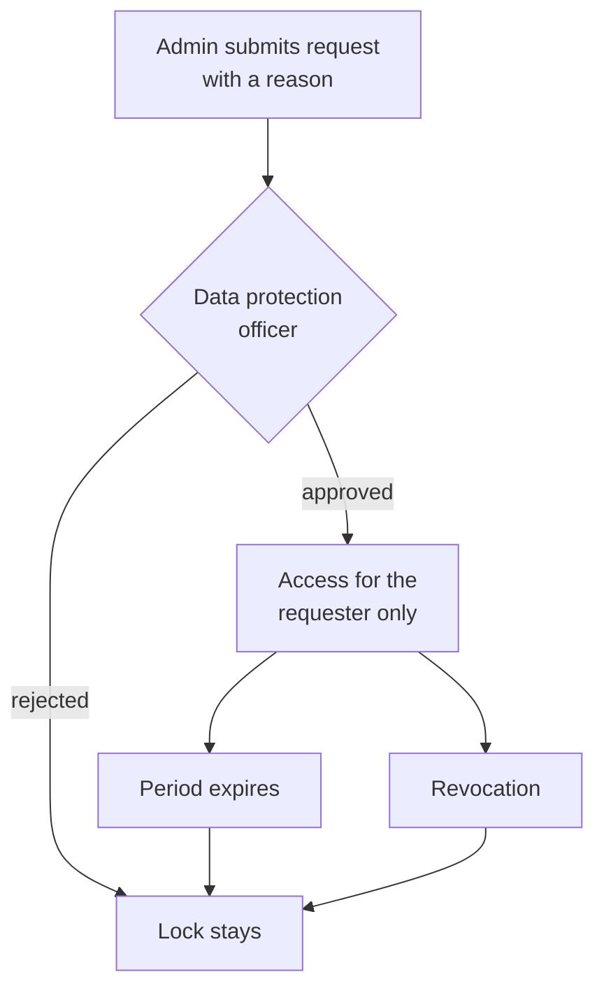

SentryMail ships with a **data protection and co-determination mode**. It is part of the open core and costs nothing extra: a data protection story that has to be bought separately convinces neither a works council nor a public authority.

The mode answers the question that comes up first in every rollout: *can the administrator see who clicked?* With the mode enabled the answer is **no** — not as a promise, but as a technical guarantee.

:::note
**Off by default.** An update never changes the behaviour of an existing installation. The operator enables the mode deliberately under **Settings → Privacy**.
:::

## Lock on individual-person evaluations

Evaluations that name individual people are rejected by the server — not hidden in the interface. Administrators cannot work around it either.

| View | Behaviour in the mode |
|---|---|
| Recipient list of a campaign | empty, with a lock notice; the metrics stay visible |
| Session history of a recipient | blocked |
| CSV export of results | blocked (it consists entirely of person rows) |
| Dashboard "failed recipients" | blocked |
| Human risk ranking | overall score and distribution remain, named list dropped |
| Management report | metrics remain, person section dropped |
| User development, department comparison, evidence (Business) | person-identifiable parts blocked, aggregated certificates remain |
| Captured form entries (Business) | blocked |
| Per-person enterprise reports | blocked |

## k-anonymity

Group evaluations are only released from **k people** upward, 5 by default. Smaller groups are not silently dropped but explicitly marked as *below threshold* — otherwise nobody in an audit would notice that figures are missing.

**People are counted, not events.** Someone who clicks twenty times remains one person and does not lift the threshold.

This affects breakdowns by browser, operating system, device, country, language, resolution and UTM source, as well as the department comparison, the trend analysis and the campaign comparison. A campaign with fewer than k recipients is effectively an individual evaluation: with three addressees a click rate of 33 percent reveals who clicked.

## Role separation

| Role | May | May not |
|---|---|---|
| Administrator | set up campaigns, evaluate in aggregate, request unlocks | evaluate individuals, approve their own requests |
| Data protection officer | grant and revoke unlocks, view the policy and the audit log | evaluate, change settings |
| User | — | administrative functions |

The **data protection officer** role is assigned in user management. It is a control role, not an analyst role: in the interface it only sees the privacy settings and the audit log.

## Four-eyes unlock

For justified individual cases — a genuine attack, for instance — the lock can be lifted temporarily.

Four properties keep the exception narrow:

- **Separate people.** Only the data protection officer may decide. A request cannot be approved by the person who submitted it — prevented via the role check, an additional check in the application **and** a constraint in the database.
- **Personal.** The unlock applies to the requester, not to the role. A second administrator still sees nothing.
- **Time-limited.** 24 hours by default, 7 days at most. After that the lock applies again automatically; no background job is involved, the state follows from the clock.
- **Optionally narrow in scope.** An unlock can be limited to **a single campaign**. Cross-campaign views then still require a global unlock.

Both the data protection officer and the requester can revoke an unlock, with immediate effect. Requests are submitted and decided under **Settings → Privacy**, section *Unlock requests*.

## Retention and anonymisation

By default **no period is set** — nothing is deleted automatically. The settings page says so explicitly, so that nobody assumes a deletion that never happens.

With a period set, the application checks hourly which **completed or cancelled** campaigns are older than that and anonymises them irreversibly.

| | |
|---|---|
| **Removed** | recipient email and name, IP address, fingerprint, referrer, user agent, screen resolution, language setting |
| **Kept** | browser, operating system, device type, country, UTM parameters, event types, timestamps |

The reason for that split: deleting the event rows would take every campaign metric with the names — and with it the NIS2 awareness record. This way it remains provable **how many** employees reacted, but no longer **who**.

The replacement address is a random value under `anonymisiert.invalid`, deliberately **not a hash** of the original: a hash could be reversed with an address list and would not be anonymisation.

Running campaigns are never touched. Every run is recorded in the audit log; the settings page shows the last run and a preview of the recipients currently due.

## Client fingerprinting

Collecting a technical browser fingerprint is **off by default** and can only be enabled by an explicit administrator decision — it is legally sensitive in co-determined workplaces and under § 25 TDDDG.

When it is off, the computation is not even injected into the landing page; in addition the server discards any value that is submitted regardless. Even when enabled, the fingerprint is **never** part of person-identifiable reports.

## What the audit log records

- Requests, approvals, rejections and revocations — each **with its reason**
- Changes to the privacy settings as the concrete change ("retention off → 180 days") rather than a blanket entry
- Every run of the automatic anonymisation with the number of affected recipients
- Changes to user accounts and roles

Readable by administrators **and** the data protection officer — a control role without access to the log would be worthless.

## Limits

:::caution[What the mode does not do]
- **Instance-wide totals stay visible.** An installation with three recipients still shows "3 recipients, 2 clicks". That is the entire population, not a group.
- **The automatic training assignment still sees the risk list** (Enterprise). It displays that list to nobody and only assigns courses — without this named exception the mode would have silently switched the assignment off. That assignment constitutes monitoring of conduct under § 87(1) no. 6 BetrVG and belongs in the works agreement.
- **The audit log contains the names and IP addresses of the acting administrators.** It documents the procedure, not the conduct of employees.
- **Anonymisation cannot be undone.** After it, even a subject access request under Art. 15 GDPR can no longer be answered — not an omission but the purpose of the rule.
:::

## Templates for the rollout

The repository contains four templates in the `compliance/` folder, each in German and English:

- **Model works agreement** — twelve sections, from excluding performance monitoring through the four-eyes procedure to the deletion rule
- **Privacy overview** — employee information under Art. 13 GDPR in plain language

Both describe exactly what the software enforces and contain placeholders for your instance's own values. They are not legal advice and should be reviewed by employment counsel before signing.

## Recommended order

1. Assign the **data protection officer** role — without it nobody can grant unlocks later on.
2. Enable the mode and set the threshold.
3. Set the retention period; the preview shows in advance how many recipients the first run will touch.
4. Fill in the templates and agree them with the employee representation.
5. Inform employees in general terms — the timing of individual simulations is not announced, otherwise the measurement is worthless.
