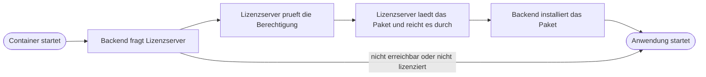

SentryMail ist Open Core: Der Kern ist quelloffen und vollständig nutzbar. Darüber hinaus gibt es
**genau zwei kostenpflichtige Add-ons**.

| Add-on | Umfang |
|---|---|
| **Business** | alle als *Business* gekennzeichneten Funktionen |
| **Enterprise** | alle *Enterprise*-Funktionen — **und alle Business-Funktionen** |

Enterprise ist kein zweites Produkt neben Business, sondern der Aufschlag darauf. Wer Enterprise
lizenziert, braucht Business nicht zusätzlich. Welche Funktion zu welcher Stufe gehört, steht
unter [Funktionsumfang](/reference/funktionen/); im Dashboard zeigt der Bereich **Add-ons**
dieselbe Zuordnung.

## 1. Kaufen

Nach dem Kauf erhalten Sie den **Lizenzschlüssel per E-Mail** an die bei der Bestellung
angegebene Adresse. Der Schlüssel ist eine lange Zeichenkette aus drei durch Punkte getrennten
Teilen und gehört zu genau einer Organisation.

Was Sie dafür angeben müssen: die E-Mail-Adresse für die Zustellung und die Zahl der zu
lizenzierenden Nutzer. Eine Installations- oder Server-Kennung brauchen wir **nicht** — der
Schlüssel ist nicht an eine bestimmte Maschine gebunden, Sie können Ihre Installation also
umziehen oder neu aufsetzen.

:::caution[Den Schlüssel sicher aufbewahren]
Der Schlüssel ist der Nachweis Ihres Kaufs. Bewahren Sie die E-Mail auf oder legen Sie den
Schlüssel in Ihrem Passwortspeicher ab. Verloren gegangene Schlüssel stellen wir erneut zu, aber
das kostet Sie Zeit.
:::

## 2. Aktivieren

Zwei Werte in der `.env` Ihrer Installation:

```ini
LICENSE_SERVER_URL=https://license.sentrymail.de
LICENSE_KEY=eyJhbGciOiJSUzI1NiIsInR5cCI6IkpXVCJ9...
```

Der Schlüssel steht in **einer** Zeile, ohne Anführungszeichen, ohne Leerzeichen davor oder
dahinter und ohne Zeilenumbruch. Kopieren Sie ihn aus der E-Mail am besten mit einem
Doppelklick auf die Zeichenkette statt durch Markieren mit der Maus — so kommt kein Leerzeichen
mit.

Alternativ lässt sich der Schlüssel im Dashboard unter **Einstellungen → Lizenz** hinterlegen.
Ein Wert in der `.env` hat dabei Vorrang.

Danach den Stack neu starten:

```bash
docker compose up -d
```

:::danger[`restart` genügt nicht]
`docker compose restart` startet nur den Prozess im vorhandenen Container — die geänderte `.env`
wird dabei **nicht** neu gelesen. Verwenden Sie `docker compose up -d`; das erkennt die geänderte
Konfiguration und legt den Container neu an.
:::

## 3. Was beim Start passiert

Die Add-ons sind **nicht** Teil des Backend-Images. Sie werden beim Start bezogen — und zwar
über den Lizenzserver, nicht von einer Paketquelle im Internet:



Drei Eigenschaften, auf die Sie sich verlassen können:

**Ein Fehlschlag hält Ihre Installation nicht an.** Ist der Lizenzserver nicht erreichbar oder die
Lizenz abgelaufen, startet SentryMail trotzdem — dann eben im Open-Core-Umfang. Ein Ausfall auf
unserer Seite legt Ihren Betrieb nicht still.

**Es wird nur geladen, was sich geändert hat.** Ist das Paket bereits in der passenden Version
installiert, überträgt der Start nichts.

**Sie brauchen keine Zugangsdaten zu einer Paketquelle.** Der Lizenzserver holt das Paket selbst
und reicht es durch. Ihre Installation kennt nur Ihren Lizenzschlüssel.

## 4. Prüfen, ob es geklappt hat

Im Dashboard: Der Bereich **Add-ons** zeigt je Stufe *lizenziert* und *installiert*. Beide müssen
grün sein — *lizenziert, aber nicht installiert* bedeutet, dass der Bezug beim Start nicht
funktioniert hat.

Im Protokoll:

```bash
docker compose logs backend | grep -i addons
```

Erwartete Ausgabe bei erfolgreicher Aktivierung:

```
addons: business: humanshield_addon_business-0.18.1-py3-none-any.whl installiert
addons: enterprise: humanshield_addon_enterprise-0.17.1-py3-none-any.whl installiert
```

Bei einer reinen Business-Lizenz erscheint nur die erste Zeile; für Enterprise erscheinen beide,
weil Enterprise die Business-Funktionen einschließt.

:::note[Warum dort „humanshield" steht]
Die Python-Pakete tragen weiterhin den früheren Namen des Produkts. Das ist Absicht: Eine
Umbenennung des Paket-Namensraums würde bestehende Installationen beim Update brechen, ohne
irgendeinen Gewinn. Produkt, Repositorien und Lizenzserver heißen **SentryMail**; nur die
Paketnamen im Inneren blieben unverändert.
:::

## 5. Wie die Freischaltung laufend funktioniert

Ihre Installation holt sich **täglich** eine kurzlebige Freigabe vom Lizenzserver, ein sogenanntes
Lease. Es ist **sieben Tage** gültig.

Daraus ergibt sich Ihre Ausfalltoleranz: Ist der Lizenzserver vorübergehend nicht erreichbar,
arbeitet Ihre Installation bis zum Ablauf des zuletzt geholten Lease unverändert weiter. Erst
danach fällt sie auf den Open-Core-Umfang zurück — sie schaltet sich nicht ab und verliert keine
Daten.

:::note[Kein Offline-Betrieb]
Eine dauerhaft vom Internet getrennte Installation kann die kostenpflichtigen Add-ons nicht
nutzen. Die Prüfung findet ausschließlich online statt; ein offline gültiges Lizenzverfahren gibt
es bewusst nicht. Der Kern bleibt davon unberührt und funktioniert ohne jede Verbindung.
:::

## 6. Welche Daten den eigenen Server verlassen

Sie betreiben SentryMail selbst, damit Ihre Daten bei Ihnen bleiben. Deshalb hier vollständig,
was bei der täglichen Lizenzprüfung übertragen wird:

| Feld | Inhalt |
|---|---|
| `license_key` | Ihr Lizenzschlüssel |
| `instance_id` | eine bei der Installation erzeugte Zufallskennung |
| `product`, `product_version` | Produktname und Versionsstand |
| `active_users` | die **Anzahl** aktiver Nutzerkonten, als Zahl |

Das ist alles. **Keine** Namen, **keine** E-Mail-Adressen, **keine** Kampagnen, **keine**
Ergebnisse, **keine** Inhalte. `active_users` ist eine Zahl ohne jeden Bezug zu einzelnen
Personen; sie dient dem Abgleich mit der lizenzierten Nutzerzahl.

## 7. Wenn eine Lizenz ausläuft

Läuft Ihr Abonnement aus oder wird gekündigt, endet die Freischaltung mit dem letzten gültigen
Lease. Was dann gilt:

- **Ihre Daten bleiben vollständig erhalten.** Es wird nichts gelöscht.
- **Bereits erzeugte Nachweise bleiben lesbar** — Abschlüsse, Zertifikate, Berichte. Das ist
  Absicht: Sie müssen Ihre Schulungsnachweise auch nach einem Wechsel vorlegen können.
- **Laufende Zuweisungen werden eingefroren, nicht verworfen.**
- Neue Aktionen der kostenpflichtigen Funktionen werden abgelehnt, die zugehörigen Seiten sind
  gesperrt.

Wird die Lizenz später erneuert, sind die Funktionen mit dem nächsten Lease wieder verfügbar —
ohne Neuinstallation.

## 8. Wenn etwas nicht funktioniert

**„Lizenzserver nicht erreichbar" mit `Name or service not known`**
Ein Tippfehler in `LICENSE_SERVER_URL` oder ein DNS-Problem. Der Wert lautet exakt
`https://license.sentrymail.de`, ohne abschließenden Schrägstrich. Prüfen mit:

```bash
curl -s -o /dev/null -w '%{http_code}\n' https://license.sentrymail.de/health
```

Erwartet: `200`.

**„Lizenzschlüssel ungültig", obwohl der Schlüssel stimmt**
Fast immer ein Übertragungsfehler: ein Leerzeichen vor dem Schlüssel, Anführungszeichen darum
oder ein Zeilenumbruch mittendrin. So prüfen Sie den Eintrag, ohne den Schlüssel anzuzeigen:

```bash
grep -c '^LICENSE_KEY=[A-Za-z0-9_.-]\+$' .env
```

`1` heißt sauber, `0` heißt: es klebt etwas daran.

**Die Änderung an der `.env` wirkt nicht**
`docker compose restart` liest die `.env` nicht neu. `docker compose up -d` verwenden.

**„lizenziert, aber nicht installiert" im Dashboard**
Die Lizenz trägt, aber der Paketbezug beim Start ist gescheitert — meist, weil zu diesem Zeitpunkt
keine Verbindung bestand. Ein `docker compose up -d` wiederholt den Versuch. Bleibt es dabei, hilft
das Protokoll:

```bash
docker compose logs backend | grep -i addons
```

Kommen Sie damit nicht weiter, schicken Sie uns diese Protokollzeilen — sie enthalten weder Ihren
Schlüssel noch personenbezogene Daten.
