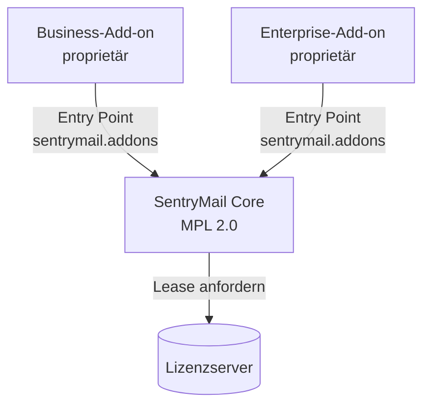
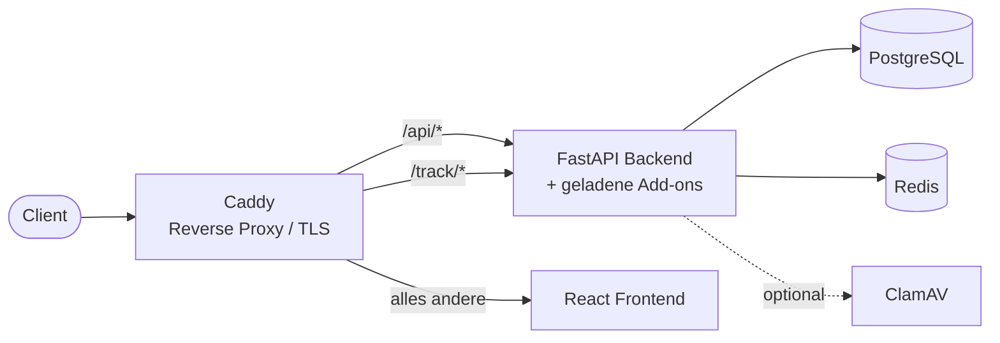

## Stack

- **Backend:** FastAPI (Python), SQLAlchemy, Alembic-Migrationen
- **Frontend:** React + Vite + TypeScript, Tailwind CSS (Design-Token-System, Light/Dark)
- **Datenbank:** PostgreSQL
- **Cache/Queue:** Redis
- **Reverse Proxy / TLS:** Caddy
- **Betrieb:** Docker Compose (rootless, gehärtet)
- **Optional:** ClamAV als Compose-Profil (`--profile scanning`), standardmäßig aus

## Open Core und Add-ons

Der Kern steht unter der MPL 2.0. Die kostenpflichtigen Funktionen liegen in **getrennten Paketen**, die nur bei lizenzierten Kunden installiert werden — nicht als abgeschalteter Code im Kern.

Ein Add-on stellt einen Entry Point in der Gruppe `sentrymail.addons` bereit, der auf ein Modul mit `FEATURE_ID` und `register(app)` zeigt. `register` hängt die eigenen Router ein — jeder hinter `require_feature(FEATURE_ID)`.

**Der Loader entscheidet nur, ob ein Paket vorhanden ist; das Feature-Gate liegt im Add-on selbst.** Ist kein Add-on installiert, passiert nichts — reiner Open-Core-Betrieb ist der Normalfall, kein Sonderfall.

Jedes Add-on bringt **eigene Migrationen mit eigener Versionstabelle** (`alembic_version_business`, `alembic_version_enterprise`). Der Kern kennt die Tabellen der Add-ons nicht; ein Add-on lässt sich nachrüsten, ohne den Kern zu migrieren.

## Lizenzierung

Die Instanz holt beim Lizenzserver ein kurzlebiges, **EdDSA-signiertes Lease**, das die freigeschalteten Feature-IDs und die Nutzerzahl trägt. Geprüft wird lokal gegen den öffentlichen Schlüssel — der Lizenzserver muss für den laufenden Betrieb nicht erreichbar sein.

Ist er es nicht, gilt das vorhandene Lease bis zum Ablauf weiter (`grace`); erst danach fallen die Add-on-Routen auf 403. Ein Netzwerkproblem soll keine laufende Kampagne stoppen.

## Routing (Caddy)

- `/api/*` → Backend (Prefix wird entfernt) — einschließlich der Add-on-Router
- `/track/*` → Backend (öffentliche Tracking-Endpunkte: Pixel, Klick, Landing, Submit)
- alles andere → Frontend

## Wichtige Konzepte

- **Singleton-Configs** in der DB: LDAP, OIDC, SMTP, Sicherheits-Policy, Datenschutz — beim ersten Zugriff angelegt.
- **Tracking-Token** pro Empfänger: unratebar, in Links und Pixel eingebettet. Bei der USB-Simulation steht das Token für den **Fundort**, nicht für eine Person.
- **Zweistufiger Login** bei aktivem 2FA: Passwort → 2FA-Code; dazwischen ein kurzlebiger, gescopeter Pre-Auth-Token, der keinen regulären API-Zugriff erlaubt.
- **Ein Durchsetzungspunkt für den Datenschutzmodus:** Die Sperre für Einzelpersonen-Auswertungen liegt in einem Modul, das jede betroffene Route aufruft — verteilte Prüfungen wären früher oder später auseinandergelaufen.
- **Hintergrund-Ticks** statt externem Scheduler: wiederkehrende und mehrstufige Kampagnen, Fristen und Erinnerungen des Schulungsmoduls, Aufbewahrungsfristen und die Zustellung offener xAPI-Statements laufen in Threads der Anwendung. Ein externer Broker wäre für On-Premise-Installationen zusätzliche Betriebslast ohne Gegenwert.

## Sicherheit

- **Passwörter:** Argon2id (OWASP-Empfehlung).
- **Laufzeit-Secrets** (SMTP-, LDAP-, OIDC-Zugangsdaten, TOTP-Secret, Token für SCIM, Melde-Button und Gateways): verschlüsselt at-rest via **Fernet**, Schlüssel abgeleitet aus `SECRET_KEY`. Über die API nie im Klartext zurückgegeben — nur ein `has_*`-Flag.
- **Betreiber-Secrets** (`SECRET_KEY`, DB-Passwort): über `.env` oder einen Secrets-Manager, siehe [Sicherheit](/reference/sicherheit/).
- **Sitzung:** httpOnly-Cookie plus CSRF-Token im Double-Submit-Verfahren.
- **Signierte URLs** für Inhalte, die kein Bearer-Token mitschicken können (Schulungsvideos, SCORM-Dateien): zeitlich begrenztes HMAC, gebunden an Modul und Zuweisung, mit eigenem Ableitungskontext je Zweck.
- **Fremder Code im Rahmen:** SCORM-Inhalte laufen in einem `sandbox`-iframe **ohne** `allow-same-origin` und erreichen die Sitzung damit nicht.
- **Backup-Codes:** nur als Hash gespeichert.

## Daten (Auszug)

**Kern:** `users`, `templates`, `groups` / `group_members`, `sending_profiles`, `landing_pages`, `campaigns`, `recipients`, `tracking_events`, `audit_events`, `security_config`, `privacy_config`, `privacy_unlock_requests`, `license_state`.

**Business-Add-on:** `scim_config`, `reported_mails`, `report_button_config`, PDF-Branding.

**Enterprise-Add-on:** `lms_*` (Kurse, Module, Zuweisungen, Fortschritt, Quiz, Nachweise, SCORM, xAPI), `mail_analyses`, `threat_scan_config`, `misp_config`, `quarantine_config` / `quarantine_runs`, `channel_gateway_config` / `channel_addresses` / `campaign_channels`, `siem_config`, `saml_config`, `whitelabel_config`.

Siehe auch: [Installation](/guides/installation/) · [Sicherheit](/reference/sicherheit/)
