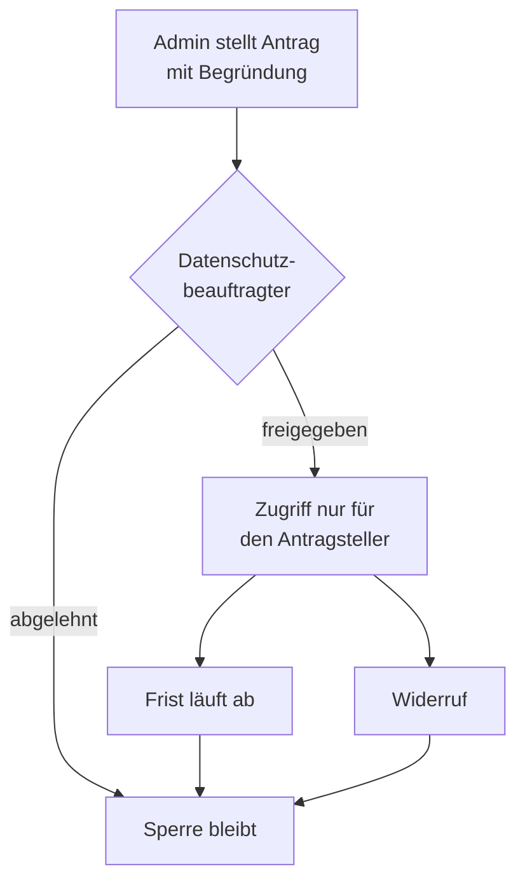

SentryMail bringt einen **Datenschutz- und Mitbestimmungsmodus** mit. Er ist Bestandteil des Open Core und kostet nichts extra: Datenschutz, den man erst dazukaufen muss, überzeugt weder Personalrat noch öffentliche Verwaltung.

Der Modus beantwortet die Frage, die in jeder Einführung zuerst kommt: *Kann der Administrator sehen, wer geklickt hat?* Bei aktivem Modus lautet die Antwort **nein** — nicht als Zusage, sondern technisch erzwungen.

:::note
**Standardmäßig ausgeschaltet.** Ein Update ändert das Verhalten einer bestehenden Installation nicht. Der Betreiber schaltet den Modus bewusst ein unter **Einstellungen → Datenschutz**.
:::

## Sperre für Einzelpersonen-Auswertungen

Auswertungen, die einzelne Personen benennen, werden vom Server abgelehnt — nicht in der Oberfläche ausgeblendet. Auch ein Administrator kommt nicht daran vorbei.

| Ansicht | Verhalten im Modus |
|---|---|
| Empfängerliste einer Kampagne | leer, mit Sperrhinweis; die Kennzahlen bleiben sichtbar |
| Sitzungsverlauf eines Empfängers | gesperrt |
| CSV-Export der Ergebnisse | gesperrt (besteht ausschließlich aus Personenzeilen) |
| Dashboard „Auffällige Empfänger" | gesperrt |
| Human-Risk-Rangliste | Gesamtscore und Verteilung bleiben, Namensliste entfällt |
| Management-Report | Kennzahlen bleiben, Personenabschnitt entfällt |
| Benutzerentwicklung, Abteilungsvergleich, Nachweise (Business) | personenbezogene Teile gesperrt, aggregierte Nachweise bleiben |
| Erfasste Formulareingaben (Business) | gesperrt |
| Enterprise-Berichte je Person | gesperrt |

## k-Anonymität

Gruppenauswertungen werden erst ab **k Personen** ausgegeben, Standard ist 5. Kleinere Gruppen werden nicht stillschweigend weggelassen, sondern ausdrücklich als *unter Schwellenwert* gekennzeichnet — sonst fiele im Audit niemandem auf, dass Zahlen fehlen.

Gezählt werden **Personen, nicht Ereignisse**. Wer zwanzigmal klickt, bleibt eine Person und hebt die Schwelle nicht auf.

Betroffen sind Aufschlüsselungen nach Browser, Betriebssystem, Gerät, Land, Sprache, Auflösung und UTM-Quelle sowie Abteilungsvergleich, Trendanalyse und Kampagnenvergleich. Eine Kampagne mit weniger als k Empfängern ist faktisch eine Einzelauswertung: bei drei Adressaten verrät eine Klickrate von 33 Prozent, wer geklickt hat.

## Rollentrennung

| Rolle | Darf | Darf nicht |
|---|---|---|
| Administrator | Kampagnen einrichten, aggregiert auswerten, Freigaben beantragen | Einzelpersonen auswerten, eigene Anträge freigeben |
| Datenschutzbeauftragter | Freigaben erteilen und widerrufen, Policy und Audit-Log einsehen | auswerten, Einstellungen ändern |
| Benutzer | — | administrative Funktionen |

Die Rolle **Datenschutzbeauftragter** wird in der Benutzerverwaltung vergeben. Sie ist eine Kontroll-, keine Auswerterrolle: in der Oberfläche sieht sie nur Datenschutzeinstellungen, die Preflight-Regeln und das Audit-Log.

Die Rolle kann zusätzlich die **Zweitfreigabe für Kampagnen hoher Risikoklasse** erteilen — Köder mit Gehalts-, Kündigungs- oder Gesundheitsbezug. Damit liegt die Entscheidung über besonders belastende Simulationen bei der Betriebsratsrolle statt beim Betrieb. Eingestellt wird das unter [Kampagnen-Preflight](/guides/preflight/).

## Vier-Augen-Freigabe

Für begründete Einzelfälle — etwa einen tatsächlichen Angriff — lässt sich die Sperre befristet aufheben.

Vier Eigenschaften halten die Ausnahme eng:

- **Getrennte Personen.** Entscheiden darf ausschließlich der Datenschutzbeauftragte. Ein eigener Antrag lässt sich nicht selbst freigeben — verhindert über die Rollenprüfung, eine zusätzliche Prüfung in der Anwendung **und** eine Bedingung in der Datenbank.
- **Persönlich.** Die Freigabe gilt dem Antragsteller, nicht der Rolle. Ein zweiter Administrator sieht weiterhin nichts.
- **Befristet.** Standard 24 Stunden, maximal 7 Tage. Danach greift die Sperre automatisch wieder; dafür läuft kein Hintergrundjob, der Zustand ergibt sich aus der Zeit.
- **Wahlweise eng im Umfang.** Eine Freigabe kann auf **eine Kampagne** begrenzt werden. Kampagnenübergreifende Ansichten brauchen dann weiterhin eine globale Freigabe.

Widerrufen können der Datenschutzbeauftragte und der Antragsteller selbst, mit sofortiger Wirkung. Beantragt und entschieden wird unter **Einstellungen → Datenschutz**, Abschnitt *Freigaben*.

## Aufbewahrungsfrist und Anonymisierung

Standardmäßig ist **keine Frist gesetzt** — es wird nichts automatisch gelöscht. Die Einstellungsseite sagt das ausdrücklich, damit niemand eine Löschung annimmt, die gar nicht stattfindet.

Mit gesetzter Frist prüft die Anwendung stündlich, welche **abgeschlossenen oder abgebrochenen** Kampagnen älter sind, und anonymisiert sie unwiderruflich.

| | |
|---|---|
| **Entfernt** | E-Mail und Name des Empfängers, IP-Adresse, Fingerabdruck, Referrer, User-Agent, Bildschirmauflösung, Spracheinstellung |
| **Erhalten** | Browser, Betriebssystem, Gerätetyp, Land, UTM-Parameter, Ereignistypen, Zeitstempel |

Der Grund für die Trennung: Würde man die Ereigniszeilen löschen, verschwänden mit den Namen auch sämtliche Kampagnenkennzahlen — und damit der Awareness-Nachweis nach NIS2. So bleibt nachweisbar, **wie viele** Beschäftigte reagiert haben, aber nicht mehr, **wer**.

Die Ersatzadresse ist ein Zufallswert unter `anonymisiert.invalid`, bewusst **kein Hash** der Originaladresse: ein Hash ließe sich mit einer Adressliste zurückrechnen und wäre keine Anonymisierung.

Laufende Kampagnen werden nie angefasst. Jeder Lauf steht im Audit-Log; die Einstellungsseite zeigt den letzten Lauf und eine Vorschau der aktuell fälligen Empfänger.

## Client-Fingerprinting

Die Erfassung eines technischen Browser-Fingerabdrucks ist **standardmäßig aus** und nur nach ausdrücklicher Admin-Entscheidung aktivierbar — im mitbestimmten Betrieb und nach § 25 TDDDG ist sie heikel.

Ist sie aus, wird die Berechnung gar nicht erst in die Landing Page eingespielt; zusätzlich verwirft der Server einen dennoch übermittelten Wert. Auch bei aktivierter Erfassung ist der Fingerabdruck **nie** Bestandteil personenbezogener Berichte.

## Was das Audit-Log festhält

- Anträge, Freigaben, Ablehnungen und Widerrufe — jeweils **mit Begründung**
- Änderungen der Datenschutzeinstellungen als konkrete Änderung („Aufbewahrungsfrist aus → 180 Tage") statt als pauschaler Eintrag
- Jeden Lauf der automatischen Anonymisierung mit Anzahl der betroffenen Empfänger
- Änderungen an Benutzerkonten und Rollen

Lesbar für Administratoren **und** den Datenschutzbeauftragten — eine Kontrollrolle ohne Einsicht ins Protokoll wäre wertlos.

## Grenzen

:::caution[Was der Modus nicht leistet]
- **Gesamtzahlen der Instanz bleiben sichtbar.** Eine Installation mit drei Empfängern zeigt weiterhin „3 Empfänger, 2 Klicks". Das ist die Gesamtpopulation und keine Gruppe.
- **Die automatische Schulungszuweisung sieht die Risikoliste weiterhin** (Enterprise). Sie zeigt sie niemandem an, sondern ordnet nur Schulungen zu — ohne diese benannte Ausnahme hätte der Modus die Zuweisung stillschweigend abgeschaltet. Die Zuweisung ist eine Verhaltenskontrolle nach § 87 Abs. 1 Nr. 6 BetrVG und gehört in die Betriebsvereinbarung.
- **Das Audit-Log enthält Klarnamen und IP-Adressen der handelnden Administratoren.** Es dokumentiert das Verfahren, nicht das Verhalten der Beschäftigten.
- **Die Massen-Quarantäne fällt nicht unter diesen Modus** (Enterprise). Sie greift auf Postfächer zu, nicht auf Kampagnendaten, und dient der Vorfallsbehandlung — ein anderer Zweck. Sie ist der weitreichendste Eingriff des Produkts und gehört als eigener Punkt in die Betriebsvereinbarung: Wer darf auslösen, in welchem Umfang, und wie wird es nachgehalten. Die Software erzwingt einen Probelauf vorab, verschiebt nur (löscht nie) und protokolliert beide Schritte. Siehe [Meldung und Analyse](/reference/meldung-analyse/).
- **Die Anonymisierung ist nicht umkehrbar.** Danach kann auch ein Auskunftsersuchen nach Art. 15 DSGVO nicht mehr beantwortet werden — kein Versäumnis, sondern der Zweck der Regel.
:::

## Vorlagen für die Einführung

Im Repository liegen im Ordner `compliance/` vier Vorlagen, jeweils DE und EN:

- **Muster-Betriebsvereinbarung** — vierzehn Paragraphen vom Ausschluss der Leistungskontrolle über das Vier-Augen-Verfahren und die Massen-Quarantäne bis zur Löschregel
- **Datenschutz-Kurzdarstellung** — Information der Beschäftigten nach Art. 13 DSGVO in einfacher Sprache

Beide beschreiben genau das, was die Software durchsetzt, und enthalten Platzhalter für die Werte der eigenen Instanz. Sie sind kein Rechtsrat und vor Abschluss arbeitsrechtlich zu prüfen.

## Empfohlene Reihenfolge

1. Rolle **Datenschutzbeauftragter** vergeben — ohne sie kann später niemand Freigaben erteilen.
2. Modus aktivieren und Schwellenwert festlegen.
3. Aufbewahrungsfrist setzen; die Vorschau zeigt vorher, wie viele Empfänger der erste Lauf anfasst.
4. Vorlagen ausfüllen und mit der Interessenvertretung abstimmen.
5. Beschäftigte allgemein informieren — der Zeitpunkt einzelner Simulationen wird nicht angekündigt, sonst ist die Messung wertlos.
